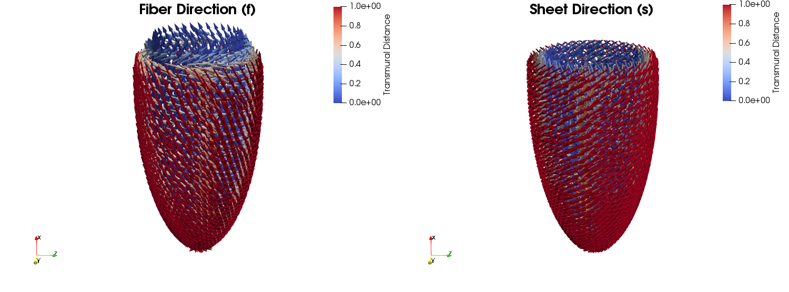
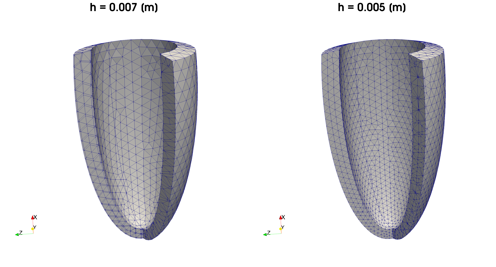

# Cardiac Benchmark Toolkit

This repository contains minimal set of scripts that allow you to reproduce the mesh
as well as the fibers in the cardiac mechanics benchmark using [dolfinx](https://github.com/FEniCS/dolfinx).



## Installation

This library requires `FEniCS` already installed in your system.

### Using Pip
Execute the following command in your local session, it will install the required dependencies:

```shell
pip3 install .
```

### Using Docker
**Docker** (Recommended) Download [docker](https://www.docker.com/).
Run the following command to start a container with dolfinx preinstalled:

```shell
docker run --name dolfinx-stable -v $(pwd):/home/shared -w /home/shared -ti ghcr.io/fenics/dolfinx/dolfinx:nightly
```

In order to enter the shell, use:

```shell
docker exec -ti dolfin-stable /bin/bash -l
```

*You can also use a image provided in folder `docker`.*

## Quickstart

### Mesh Generation

#### Preliminaries

The mesh creation relies on `h5py` and `meshio`. Install them by executing the folling command:

```shell
pip3 install --no-binary=h5py h5py meshio
```

#### Generating mesh
The ellipsoid domain can be created with a characteristic element size (default is `0.005 [m]`) using the
script `mesh_generation.py`. It will create a folder structure `./results` to stores `xdmf` as well as `pvd` formats
for further usage.

To execute it, consider the following command:
```shell
cardiac_benchmark_toolkit/mesh_generation.py -size 0.007
```

It will create an ellipsoid mesh with characteristic element size of `0.007 [m]`. You can use it in conjuntion with the
`ellipsoid_fiber_generation` to create the fiber directions for your specific simulation (and benchmark).

Example cases at different element sizes can be seen below:


### Fiber Generation

#### Preliminaries

Saving binary solutions require `PetscBinaryIO`, the module can be loaded using:
```shell
export PYTHONPATH=$PYTHONPATH:/usr/local/petsc/lib/petsc/bin/
```
if `PETSc` was installed in `/usr/local/` (e.g. in the case of the `docker` image).


##### Generating fibers
This repository provides an ellispoid tagged mesh for reference purposes in the folder `./meshes`.
Use the mesh `./meshes/ellipsoid_0.005.xdmf`, you can create the fibers as follows:

```shell
python3 cardiac_benchmark_toolkitx/fiber_generation.py ./meshes/ellipsoid_0.005.xdmf
```

If succesfull, the script will create fibers in `xdmf`, `vtk` and `PETSc binaries` files in a `./results/` folder.

Further options can be found with:

```shell
python3 cardiac_benchmark_toolkitx/fiber_generation.py --help
```
